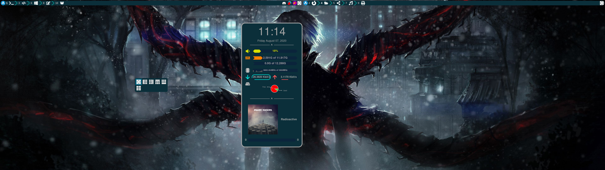
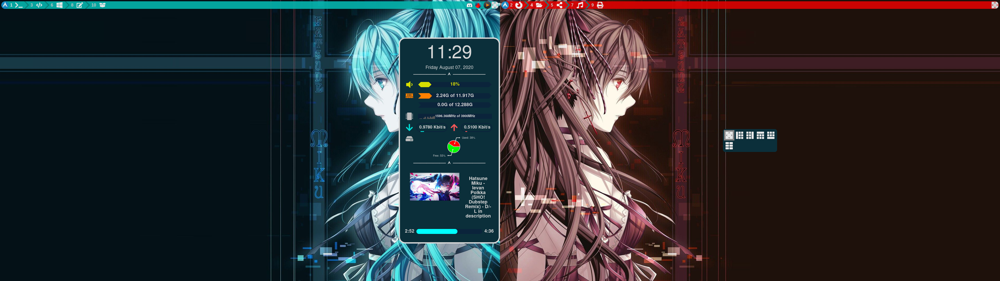
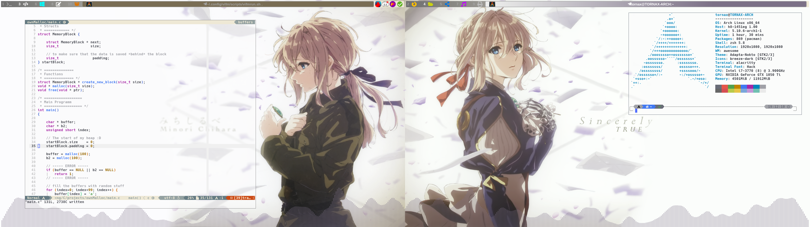

# Screenshots

Tokyo Ghoul theme:

Miku theme:

Violet Evergarden Theme:

# What do I need to get this work?

## Change the values of the following files

- `global_values.lua`:  
  Just adjust all values **(especially `awesome_dir`!!!)**
- `widgets/current_time.lua`: 
  Set your timezone in `local _current_time`
- `widgets/bar_time.lua`: 
  Set your timezone in `textclock`
- `scripts/filesystem.sh`:  
  Change the path in `grep` to your partition!
- `scripts/network.sh`:  
  Change (if needed) the interfaces

## Required Dependencies

| Package name  | Usage              |
| ------------- | ------------------ |
| `awesome-git` | The window manager |

Yeah, that's it xD It should work out of the box with that.

## Optional Dependencies

|              Package name              | Usage                            |
| :------------------------------------: | -------------------------------- |
|              `alacritty`               | Terminal                         |
| `deepin-screenshot` and/or `flameshot` | For doing screenshot             |
|                `glava`                 | Music visualisation              |
|              `Liberation`              | The font I'm using for awesomewm |

# General Keybindings (more in my "mappings/keybindings.lua" and "mappings/keymodes.lua")

So first of the keybindings are _i3-like_! So the _main-key_ is the _alt_-key. You can switch the tags with _alt + <number>_ and switch between _tabbed mode (alt + w)_ (kinda) and _splitted mode (alt + e)_. 

## Important aliases

| Aliasname | Keyboard-key  |
| --------- | ------------- |
| modkey    | `alt`         |
| modkey2   | `windows-key` |

## i3-Like keybindings

|          Keybinding          | Description                                                     |
| :--------------------------: | :-------------------------------------------------------------- |
|         `modkey + w`         | Use the "tabbed"-mode (rather stack)                            |
|         `modkey + e`         | Use the "vertical-split"-mode                                   |
|     `modkey + <number>`      | Open tag `<number>`                                             |
|         `modkey + -`         | Minimize the window                                             |
|     `modkey + Shift + -`     | Open the minimized window                                       |
|       `modkey + Space`       | Toggle floating window                                          |
| `modkey + j` or `modkey + k` | Switch focus. Sadly you can just _cycle_ through the windows :( |
|     `modkey + Shift + r`     | Restart awesome                                                 |
|     `modkey + Shift + e`     | Exit awesome                                                    |
|     `modkey + Shift + q`     | Close window                                                    |

## Other keybindings

|               Keybinding                | Function                                                                                                                                          |
| :-------------------------------------: | :------------------------------------------------------------------------------------------------------------------------------------------------ |
|              `modkey + m`               | Toggle popup                                                                                                                                      |
|            `modkey + space`             | Open Layout-popup (cycle with `space` and cycle back with `space` + `shift` or `j` and `k`, etc. (take a look into the `mappings/keymodes.lua`!)) |
| `modkey + Arrowkey(Up/Down/Left/Right)` | Resize the window                                                                                                                                 |
| `modkey + shift` + `Arrowkey(Up/Down)`  | Change the amount of master-windows                                                                                                               |

## Change the Theme

|           Keybinding           | Function                                |
| :----------------------------: | :-------------------------------------- |
| `modkey2 + h` **and then** `k` | Set the theme to `kaneki`/`tokyo_ghoul` |
| `modkey2 + h` **and then** `m` | Set the theme to `miku`                 |
| `modkey2 + h` **and then** `v` | Set the theme to `violet`               |

**Hint:** You need to restart awesome after changing the theme!

## Music Visualisation

|           Keybinding           |       Function       |
| :----------------------------: | :------------------: |
| `modkey2 + g` **and then** `s` |     Spawn glava      |
| `modkey2 + g` **and then** `k` |      Kill glava      |
| `modkey2 + g` **and then** `r` | reload/refresh glava |

## Movement - Keybindings

These are my "special" keybindings
| Keybinding | Function |
| :-----------------------: | :-------: |
| `modkey2 + t` | Move to tag 1 (**T**erminal tag) |
| `modkey2 + f` | Move to tag 2 (**F**irefox (now Browser) tag) |
| `modkey2 + c` | Move to tag 3 (**C**ode tag) |
| `modkey2 + [v, r]` | Move to tag 4 (**v**ifm, at that time **r**anger) tag |
| `modkey2 + d` | Move to tag 5 (**D**discord tag (now Social-Tag)) |
| `modkey2 + w` | Move to tag 6 (**W**indows tag (for microsoft teams)) |
| `modkey2 + p` | Move to tag 9 (**P**rinter (and scanner) tag) |
| `modkey2 + b` | Move to tag 10 (Virtual **B**ox tag) |

# Rest

I think that this were the most important information.  
If you find any issues create a new issue and I'll take a look!
