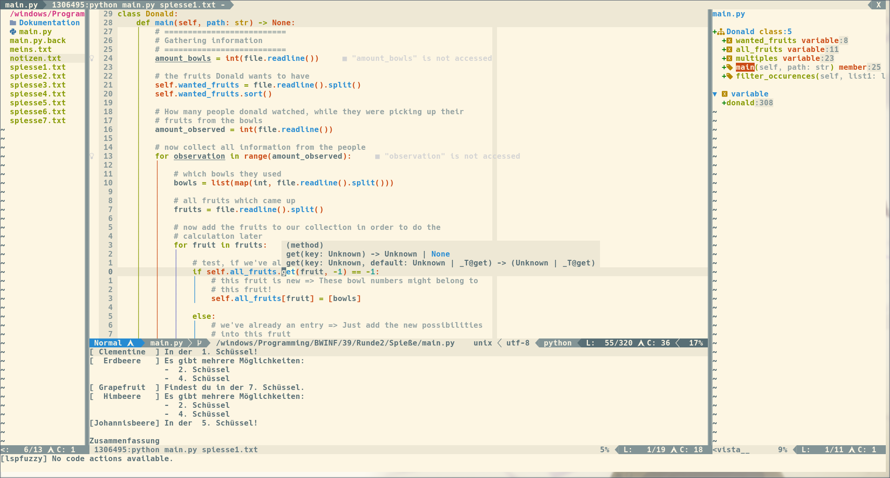

# Screenshot


# Dependencies
- Neovim nightly

Yeah, I think that's all you'll need

# Repository structure
```
my_configs
├── autocmds.vim      # here are my autocommands
├── coc-settings.json # some settings for coc (I don't use it anymore)
├── colors            # solarized colorschemes
├── colorscheme.vim   # my settings for solarized colorscheme
├── commands.vim      # some "self"-made commands
├── ftplugin          # mappings and settings for specifique filetypes
├── ginit.vim         # GUI settings (I don't use it anymore)
├── init.vim          # All Plugins are loaded here and the settings are sourced from the plugins directory
├── lua               # plugin-settings for lua stuff like LSP
├── mappings.vim      # my mappings which are independent from the plugins
├── plugins           # all settings from almost all plugins I've tried :D
├── README.md         # What you are looking at...
├── Screenshot.png    # The screenshot from the README
├── settings.vim      # all settings for vim
└── UltiSnips         # My snippets for C, LaTeX, Python and so on
```
