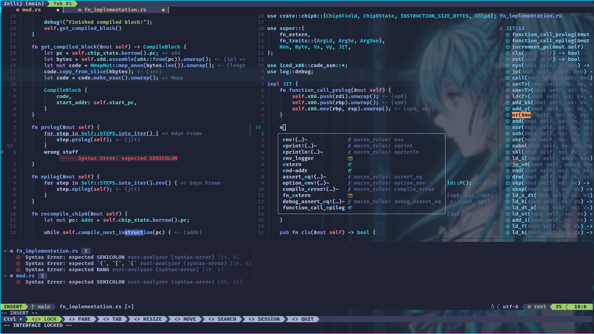

# Screenshot


# Dependencies
- Neovim nightly

Yeah, I think that's all you'll need

# Repository structure
```
my_configs
├── autocmds.vim      # here are my autocommands
├── colors            # some colorschemes
├── colorscheme.vim   # my settings for solarized colorscheme
├── commands.vim      # my custom commands for general usage
├── ftplugin          # mappings and settings for specifique filetypes
├── ginit.vim         # GUI settings (I don't use it anymore)
├── init.vim          # * Start here to understand my config
├── lua               # plugin-settings for lua stuff like LSP
├── mappings.vim      # my mappings which are independent from the plugins
└── settings.vim      # all `set` (settings) lines
```
